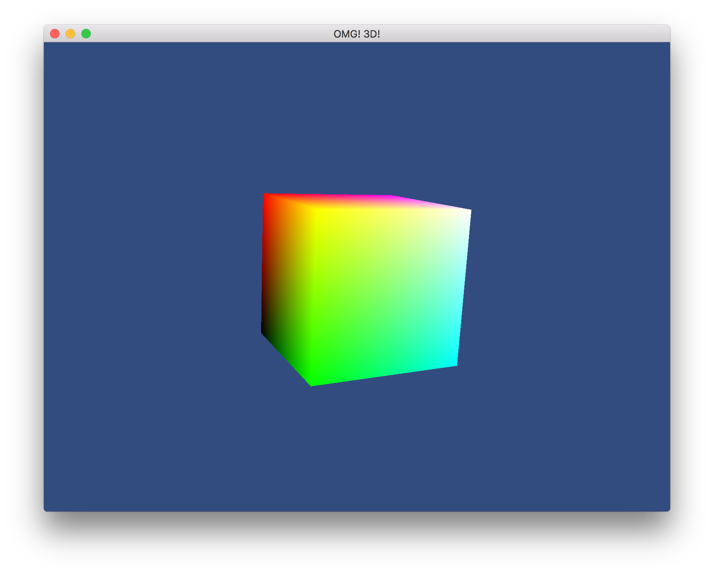

Crystal OpenGL Rotating Cube
============================

A rotating colorful cube in Crystal.

How To Run
----------

Assuming you have a working installation of Crystal, and glfw3 (`brew install glfw3`):

```
# install dependencies
shards

# run
crystal src/main.cr

# or build
crystal build src/main.cr -o cube
./cube
```

`esc` in the window, or `ctrl-c` in the terminal to quit.

Screenshot
----------


